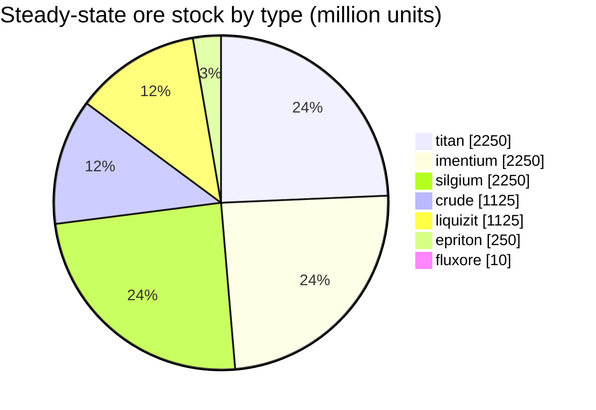

<!-- Generated by tools/generate from the live database (source: zones, mineralconfigs, plantrules, teleportdescriptions, strongholdexitconfig).
     Do not edit by hand; regenerate instead. -->
# zone_gamma_z114

  <a href="/zones/map/">
    
    <strong>World map</strong> — where this zone sits among all the others, with the teleport connections. Open the full map.
  </a>

Where this zone's teleport columns stand (dots, labelled with the destination — dimmed where the column is currently switched off), the landing spots of teleports arriving from other zones (dashed circles), and the exit gates (diamonds) where one exists. Positions are the tile coordinates the server records.

An open-PvP (beta) frontier belt island — players can attack freely and blobs apply. It maintains 7 ore types.

| Fact | Value |
|---|---|
| Zone id | 114 |
| Type | PvP |
| Protection | [Beta](/zones/protection/) — open PvP, standard terrain |
| Size | 2048×2048 tiles |
| Tier | T0 (server-recorded) |
| Fertility | 15 |
| Plant species | 15 (rule set 10) |
| Ore types | 7 |
| Total ore nodes | 47 |
| PBS tech limit | 0 |
| Max docking bases | none |

## Ore configuration

The node generation this zone maintains. Per-ore yields and the generation formulas are in [Ores](/content/ores/) (this zone's section is linked below).

| Material | Nodes | Max tiles/node | Total per node | Min threshold |
|---|---|---|---|---|
| [titan](/content/ores/titan/) | 10 | 600 | 225M | 0.5 |
| [crude](/content/ores/crude/) | 5 | 600 | 225M | 0.5 |
| [imentium](/content/ores/imentium/) | 10 | 600 | 225M | 0.5 |
| [liquizit](/content/ores/liquizit/) | 5 | 600 | 225M | 0.5 |
| [epriton](/content/ores/epriton/) | 5 | 300 | 50M | 0.5 |
| [silgium](/content/ores/silgium/) | 10 | 600 | 225M | 0.5 |
| [fluxore](/content/ores/fluxore/) | 2 | 200 | 5M | 0.5 |

[Zone index](/zones/zone-index/) · [World map](/zones/map/#t1) · [Protection levels](/zones/protection/)
