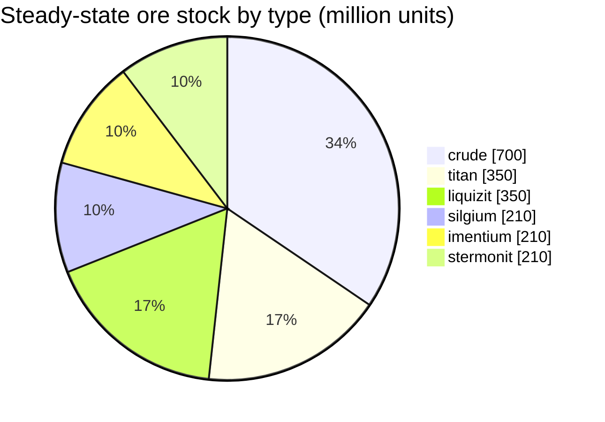

<!-- Generated by tools/generate from the live database (source: zones, mineralconfigs, plantrules, teleportdescriptions, strongholdexitconfig).
     Do not edit by hand; regenerate instead. -->
# Hershfield (zone_TM_pve)

Where this zone's teleport columns stand (dots, labelled with the destination — dimmed where the column is currently switched off), the landing spots of teleports arriving from other zones (dashed circles), and the exit gates (diamonds) where one exists. Positions are the tile coordinates the server records. This zone has local (in-zone) teleports — move the cursor near one of their columns and the dashed line between the pair's two locations stays lit.

A protected (Alpha) New Virginia (TM) zone — safe from player attack, the standard gathering ground for the New Virginia (TM) galaxy. It maintains 6 ore types.

| Fact | Value |
|---|---|
| Zone id | 8 |
| Type | PvE |
| Protection | [Alpha](/zones/protection/) — protected, PvP disabled |
| Size | 2048×2048 tiles |
| Fertility | 20 |
| Plant species | 15 (rule set 0) |
| Ore types | 6 |
| Total ore nodes | 42 |
| Max docking bases | none |

## Ore configuration

The node generation this zone maintains. Per-ore yields and the generation formulas are in [Ores](/content/ores/) (this zone's section is linked below).

| Material | Nodes | Max tiles/node | Total per node | Min threshold |
|---|---|---|---|---|
| [titan](/content/ores/titan/) | 7 | 750 | 50M | 0.5 |
| [crude](/content/ores/crude/) | 7 | 750 | 100M | 0.5 |
| [stermonit](/content/ores/stermonit/) | 7 | 750 | 30M | 0.5 |
| [imentium](/content/ores/imentium/) | 7 | 750 | 30M | 0.5 |
| [liquizit](/content/ores/liquizit/) | 7 | 750 | 50M | 0.5 |
| [silgium](/content/ores/silgium/) | 7 | 750 | 30M | 0.5 |

## Connections

**Teleports out** (TP columns from this zone):

- → [Hokkogaros](/zones/zone-asi-a-real/) (3 TP points)
- → [Shinjalar](/zones/zone-asi-pve/) (1 TP point)
- → [Attalica](/zones/zone-ics/) (1 TP point)
- → [Domhalarn](/zones/zone-ics-a-real/) (3 TP points)
- → [Tellesis](/zones/zone-ics-pve/) (1 TP point)
- → [New Virginia](/zones/zone-tm/) (2 TP points)
- → [Norhoop](/zones/zone-tm-a-real/) (3 TP points)

**Teleports in** (other zones with a TP column to this one):

- ← [Hokkogaros](/zones/zone-asi-a-real/) (3 TP points)
- ← [Shinjalar](/zones/zone-asi-pve/) (1 TP point)
- ← [Attalica](/zones/zone-ics/) (1 TP point)
- ← [Domhalarn](/zones/zone-ics-a-real/) (3 TP points)
- ← [Tellesis](/zones/zone-ics-pve/) (1 TP point)
- ← [New Virginia](/zones/zone-tm/) (2 TP points)
- ← [Norhoop](/zones/zone-tm-a-real/) (3 TP points)

[Zone index](/zones/zone-index/) · [World map](/zones/map/#starter-islands) · [Protection levels](/zones/protection/)
